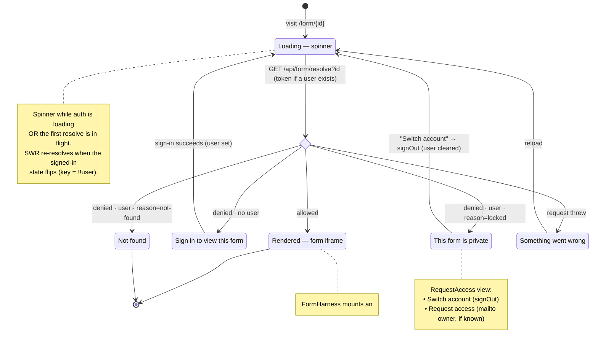
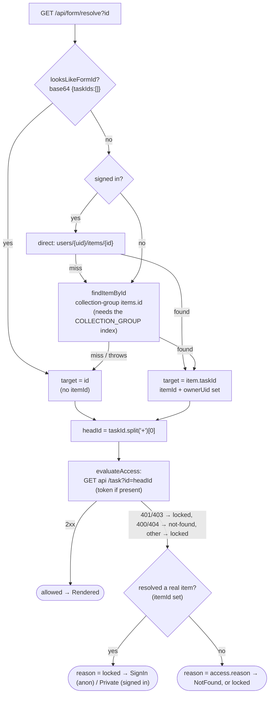

# `/form/{id}` state machine

What happens when a user visits `app.graffiticode.org/form/{id}`.

The page (`src/app/form/[id]/page.tsx`) is a client component. It resolves the
URL segment with `useSWR` keyed on `[id, !!user]`, so the resolve re-runs every
time the **signed-in state flips** (sign-in / sign-out) — that re-resolution is
what makes sign-in / switch-account feel circular. For item-backed forms SWR also
polls the resolve every 8s and revalidates on focus/reconnect, so a task the
creator edits elsewhere is picked up and the form auto-reloads.

## Client-visible states

| State | Condition | What the user sees |
|---|---|---|
| **Loading** | auth `loading`, or first resolve in flight | spinner |
| **Rendered** | `allowed` | the form (`FormHarness` iframe) |
| **SignIn** | `denied` & `!user` | "Sign in to view this form" + Sign in |
| **Private** | `denied` & `user` & `reason=locked` | "This form is private" + Switch account / Request access |
| **NotFound** | `denied` & `user` & `reason=not-found` | "Not found" |
| **Error** | resolve threw | "Something went wrong" |

## Server resolve decision (inside the Loading → decide edge)

`/api/form/resolve` (`resolvers.ts`) maps the URL segment to a task id, then asks
the api store whether the viewer may see it.

The `itemId set → reason=locked` override is the recent fix: a resolved item
provably exists, so a denial means "you can't see this" (prompt sign-in /
switch-account), never the dead-end "Not found". Only ids that don't resolve to
a real item (a bad id, or a base64 form id the api can't find) report
`not-found`.

## Why the flow feels weird

1. **Stale session → Private instead of SignIn.** A visitor who feels "logged
   out" but whose `useGraffiticodeAuth` still returns a non-null `user` skips the
   SignIn branch and lands on Private ("Switch account"). The branch is chosen by
   `!user`, not by token validity.

2. **Switch account is a two-hop.** Private's "Switch account" only calls
   `signOut`; that clears `user` → the SWR key (`!!user`) flips → re-resolve as
   anonymous → SignIn. The user then signs in. There is no single "sign in as a
   different account" action.

3. **Sign-in can bounce back.** After SignIn succeeds, SWR re-resolves with the
   new token. If that account also lacks access, it returns to Private — so it
   can look like signing in "did nothing".

4. **Two spinners.** Loading (resolve) hands off to Rendered, which shows its own
   FormHarness spinner until the iframe posts back — a brief double-spinner.
